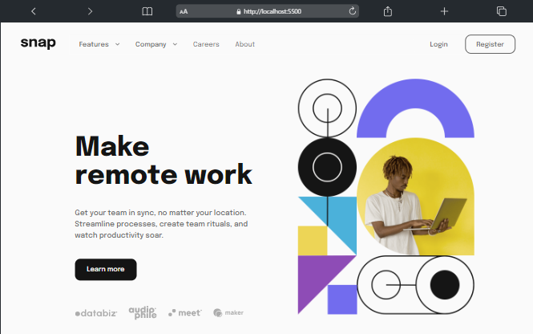
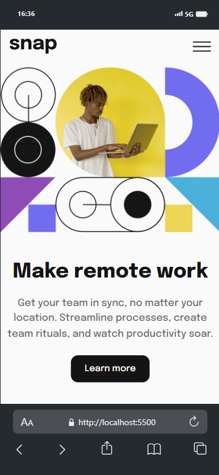

# Welcome! 👋

# Frontend Mentor - Intro section with dropdown navigation

This is a solution to the [Intro section with dropdown navigation challenge on Frontend Mentor](https://www.frontendmentor.io/challenges/intro-section-with-dropdown-navigation-ryaPetHE5). Frontend Mentor challenges help you improve your coding skills by building realistic projects.

## Table of contents

- [Overview](#overview)
  - [The challenge](#the-challenge)
  - [Screenshot](#screenshot)
  - [Links](#links)
- [My process](#my-process)
  - [Built with](#built-with)
  - [What I learned](#what-i-learned)
  - [Continued development](#continued-development)
- [Author](#author)

## Overview

### The challenge

Users should be able to:

- View the relevant dropdown menus on desktop and mobile when interacting with the navigation links
- View the optimal layout for the content depending on their device's screen size
- See hover states for all interactive elements on the page

### Links

- Live Site URL: [Intro section with dropdown navigation](https://liwgar.github.io/006_intro_section_navigation/)

### Screenshot

  

  

  
  
  

## My process

### Built with

- Git & Github.
- Semantic HTML5 markup
- CSS3 custom properties
- Flexbox
- Mobile-first workflow

### What I learned

- Apply responsive design for any device.
- Apply flexbox.
- Improve semantic HTML5 markup.
- Improve CSS custom properties.

### Continued development

The objective is:
- Improve the practice of styles with flexbox and grid.

## Author

- Website - [LiwGAr](https://liwgar-portfolio.vercel.app/)
- Frontend Mentor - [@Liwgar](https://www.frontendmentor.io/profile/LiwGar)

## Solution

I've just completed a front-end coding challenge from @frontendmentor! 🎉

You can see my solution here: https://www.frontendmentor.io/solutions/intro-section-with-dropdown-navigation-using-css-flexbox-oz5FfNw721

Any suggestions on how I can improve are welcome!

